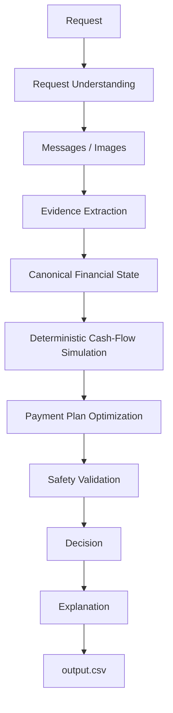

# Buy or Wait? — AI-Powered Financial Affordability Agent

A robust, hybrid AI/deterministic engine that determines whether a user can safely afford a requested expense by considering their current balance, recurring expenses, pending payments, essential spending, confirmed income, financial events, unstructured messages, invoice images, payment options, user preferences, and a strict 90-day cash-flow forecast.

## 1. Problem

A user requests an expense and the system must determine whether the expense can be safely completed. The objective is NOT simply: *"Does the user have enough money today?"* Instead, the system must logically reason about future cash flow and ensure that the complete proposed payment plan remains financially safe without ever dipping below their minimum required balance across a 90-day horizon.

## 2. Solution Overview



## 3. IMPORTANT DESIGN PRINCIPLE

> **AI understands. Evidence validates. Code calculates. Optimization chooses. Validation guarantees. Evaluation proves.**

Financial calculations are not delegated blindly to an LLM. Instead:
- AI (LLM/VLM) is strictly responsible for understanding unstructured context and extracting evidence.
- Evidence is normalized and validated.
- Deterministic code performs all floating-point arithmetic and financial calculations.
- Payment plans are mathematically evaluated against safety constraints.
- Validation prevents unsafe decisions from ever being recommended.
- The evaluation suite rigorously measures system quality.

## 4. Why There Is No Frontend?

> **This challenge does not require a web frontend. The official task evaluates the financial decision agent through the generated `output.csv` and the submitted runnable solution.**

This project intentionally prioritizes:
- Financial correctness
- Precise AI extraction
- Deterministic cash-flow simulation
- Payment-plan optimization
- Absolute safety validation
- Evaluation and reproducibility

Because of these priorities, presentation layers like React, Next.js, or Tailwind dashboards are intentionally outside the scope. **No frontend is required for the competition submission, so the project does not include a UI layer.**

## 5. Output

The pipeline generates an `output.csv` with the exact required schema:
- `request_id`
- `amount_safe_to_pay`
- `affordability_status`
- `recommended_payment_method`
- `payment_plan`
- `earliest_date_for_full_payment`
- `spending_changes_needed`
- `decision_explanation`

**Affordability Statuses:**
- `affordable_now`
- `affordable_with_plan`
- `affordable_later`
- `not_affordable`

**Recommended Payment Methods:**
- `full_payment`
- `partial_payment`
- `installments`
- `wait`
- `not_recommended`

All payment plans strictly adhere to chronological formatting constraints.

## 6. Financial Safety Model

A payment plan is considered safe only when:
1. The user can complete the required payment plan by the deadline.
2. Essential expenses remain covered.
3. The projected balance over the 90-day forecast never drops below the `minimum_balance_to_keep`.
4. All relevant recurring obligations are respected.

This mathematically guarantees that a recommended purchase will not cascade into financial distress.

## 7. AI / Evidence Processing

The system bridges unstructured human inputs (messages, invoices) with structured data. It extracts intentions (e.g., job losses, upcoming bonuses, or new debts) and emits factual events.

We explicitly distinguish:
- **Confidence:** How confident the model is that it successfully extracted and interpreted the text/image correctly.
- **Certainty:** How certain the underlying financial fact is (e.g., a signed contract vs. an expected birthday gift).

Missing, stale, or conflicting information is mediated before it enters the deterministic engine.

## 8. Payment Plan Optimization

Candidate payment plans are dynamically generated and evaluated. The implementation enforces the following priorities:
1. Complete the payment by the required deadline.
2. Avoid unnecessary spending changes.
3. Minimize total cost to the user.
4. Start payments earlier when appropriate.
5. Minimize the number of individual payments.
6. Apply deterministic tie-breaking where plans are identical in cost and timing.

## 9. Spending Changes

When an expense cannot be afforded naturally, the system determines if discretionary flexible expenses can be safely trimmed. 
Supported actions:
- `stop:<event_id>`
- `reduce_to:<event_id>:<new_amount>`

Essential expenses (housing, utilities, food) are permanently protected and cannot be reduced.

## 10. Data

The pipeline executes against the official competition datasets:
- `dataset/requests.csv`
- `dataset/financial_profiles.csv`
- `dataset/financial_events.csv`
- `dataset/exchange_rates.csv`
- `dataset/request_payment_options.csv`
- `dataset/messages.csv`
- `dataset/images.csv`
- `dataset/media/images/`

These files must remain unaltered as part of the execution contract.

## 11. Running the Project

To execute the pipeline and generate predictions:
```bash
python3 code/main.py
```
The final predictions are written directly to `output.csv`. The LLM interactions require a valid API key configured in `.env`.

## 12. Evaluation

The repository includes a comprehensive testing suite that validates:
- Schema enforcement
- Financial invariant preservation
- Deterministic execution
- AI hallucination resilience
- Adversarial edge cases

**Latest Internal Validation Metrics:**
- `affordability_status`: 76.0%
- `recommended_payment_method`: 84.0%
- `earliest_date_for_full_payment`: 60.0%

*(Metrics represent proxy validation scores against the sampled evaluation set, not the final hidden leaderboard)*.

## 13. Project Structure

```text
.
├── AGENTS.md
├── README.md
├── problem_statement.md
├── code/
├── evaluation/
├── docs/
├── dataset/
├── output.csv
└── code.zip
```

## 14. Reproducibility

To ensure identical grading, the system is designed with:
- Completely deterministic financial calculations.
- Caching implementations.
- Provider abstractions for the LLM/VLM layer.
- Fully reproducible dataset ingestion pipelines.

## 15. Submission Artifacts

The final HackerRank submission requires:
- `code.zip` (Runnable solution, `README.md`, `evaluation/usage_report.md`, and logic files)
- `output.csv` (The final predictions)
- `chat_transcript` (If applicable)

## 16. Engineering Philosophy

The system deliberately separates probabilistic AI interpretation from deterministic financial computation. AI is used where language and multimodal understanding are valuable; financial safety decisions are verified by executable rules and simulation.
